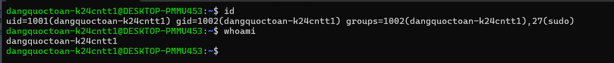

 # DevOps Hackathon – Đề 002: Quản lý sản phẩm (Shop)

## 1. Thông tin sinh viên
| Họ và tên | Mã sinh viên | Lớp | Tài khoảnLinux | GitHub | Cổng Nginx |
|-----------|--------------|----------------------|--------|------------|
| Đặng Quốc Toàn | B24CTCN161 | k24CNTT1 |dangquoctoan-k24cntt1 | https://github.comTly-gitt/devops-hackathon-de002-dangquoctoan/treemain | 8088 |

## 2. Môi trường triển khai
- Hệ điều hành: Ubuntu 24.04 LTS (x86_64)
- Phiên bản Nginx: Nginx 1.18.0
- Phiên bản Git: Git 2.34.1
- Nơi chạy: Ubuntu

## 3. Cấu trúc dự án
```text
devops-hackathon-de002-dangquoctoan/
├── .gitignore
├── README.md
├── nginx/
│   └── dangquoctoan-k24cntt1.conf
├── screenshots/
│   ├── 01-user.png
│   ├── 02-nginx.png
│   ├── 03-ufw.png
│   ├── 04-website.png
│   ├── 05-git-log.png
│   └── 06-update.png
└── src/
    └── index.html
```

## 4. Cấu hình Nginx

Tham số trong template | Giá trị đã điền             | Giải thích
------------------------|-----------------------------|----------------------------------------------------
<PORT>                 |8089                        | Cổng dịch vụ Nginxlắng nghe riêng cho sinh viên
                          |                             | (IPv4 & IPv6), tránh đụng độ cổng 80
<SERVER_NAME>          |172.25.205142               | Địa chỉ IP của máy chủ lấy từlệnh hostname -I
<WEB_ROOT>             | /var/wwwdevops-hackathon-  | Đường dẫn tuyệt đối trỏ chínhxác vào thư mục chứa
                          | de002-dangquoctoan/src      | mã nguồn web tĩnh src/
<INDEX_FILE>           | indexhtml                  | File trang chủ mặc địnhđược phục vụ khi truy cập
                          |                             | root
<TEN_TAI_KHOAN>        |dangquoctoan-k24cntt1       | Tên tài khoản Linuxdùng để đặt tiền tố cho file
                          |                             | access.log và error.log
<ALLOW_DIRECTIVE>      | allowall;                  | Chỉ thị Nginx cho phép tấtcả các request từ bên
                          |                             | ngoài truy cập vào location /

## 5. Tường lửa UFW

• Các rule đã cấu hình:
    • 22/tcp ALLOW IN Anywhere: Cho phép truy cập SSH từ xa trước khi kích hoạt tường lửa.
    • 8088/tcp ALLOW IN Anywhere: Cho phép truy cập website qua cổng dịch vụ cá nhân.
• Kết quả kiểm tra lệnh sudo ufw status verbose:

## 6. Các bước triển khai

1. Tạo tài khoản Linux:
sudo useradd -m -s /bin/bash -U -G sudo dangquoctoan-k24cntt1 
sudo passwd dangquoctoan-k24cntt1 
su - dangquoctoan-k24cntt1 

2. Cài đặt các gói công cụ:
sudo apt update && sudo apt install -y nginx git ufw curl
sudo systemctl enable --now nginx

3. Clone repository và phân quyền:
cd /var/www
sudo git clone https://github.com/Tly-gitt/devops-hackathon-de002-dangquoctoan/tree/main
sudo chown -R dangquoctoan-k24cntt1:dangquoctoan-k24cntt1 /var/www/devops-hackathon-de002-dangquoctoan
sudo find /var/www/devops-hackathon-de002-dangquoctoan -type d -exec chmod 755 {} +
sudo find /var/www/devops-hackathon-de002-dangquoctoan -type f -exec chmod 644 {} +

4. Cấu hình Nginx server block:
sudo cp /var/www/devops-hackathon-de002-dangquoctoan/nginx/dangquoctoan-k24cntt11.conf /etc/nginx/sites-
  available/
sudo ln -s /etc/nginx/sites-available/dangquoctoan-k24cntt1.conf /etc/nginx/sites-enabled/
sudo rm -f /etc/nginx/sites-enabled/default
sudo nginx -t
sudo systemctl reload nginx

5. Cấu hình tường lửa UFW:
sudo ufw allow 22/tcp
sudo ufw allow 8089/tcp
sudo ufw enable


## 7. Kiểm tra & minh chứng

• Minh chứng tài khoản người dùng:

• Minh chứng trạng thái Nginx:

• Minh chứng tường lửa UFW:

• Minh chứng truy cập website ban đầu:

• Minh chứng lịch sử Git:

• Minh chứng website sau khi cập nhật:


## 8. Quy trình cập nhật website

1. Chỉnh sửa nội dung file src/index.html (thêm dòng cập nhật phiên bản 2).
2. Thực hiện commit thay đổi và push lên nhánh main của GitHub repo.
3. Trên máy chủ, truy cập vào thư mục /var/www/devops-hackathon-de002-nguyenvana và chạy git pull origin
  main.
4. Không cần reload Nginx vì Nginx tự động đọc file tĩnh mới nhất từ thư mục web root.
5. Tải lại trang web trên trình duyệt để kiểm tra kết quả hiển thị.

## 9. Sự cố gặp phải & cách khắc phục

• Sự cố 1 (Xung đột trang mặc định): Ban đầu trang web hiển thị "Welcome to nginx!" thay vì website cá nhân.
    • Khắc phục: Gỡ symlink default bằng lệnh sudo rm /etc/nginx/sites-enabled/default và chạy sudo
      systemctl reload nginx.
• Sự cố 2 (Quyền thư mục khi git pull): Khi chạy git pull báo lỗi Permission denied.
    • Khắc phục: Sử dụng sudo chown -R nguyenvana-d21cntt1:nguyenvana-d21cntt1 để gán quyền sở hữu thư mục
      repo về cho tài khoản cá nhân.


Cuối cùng, commit và push toàn bộ ảnh + README.md lên GitHub:
```bash
    git add screenshots/ README.md
    git commit -m "docs: finalize screenshots and comprehensive README documentation"
    git push origin main
```